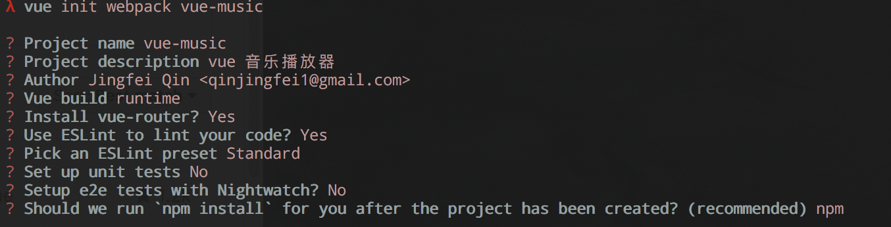
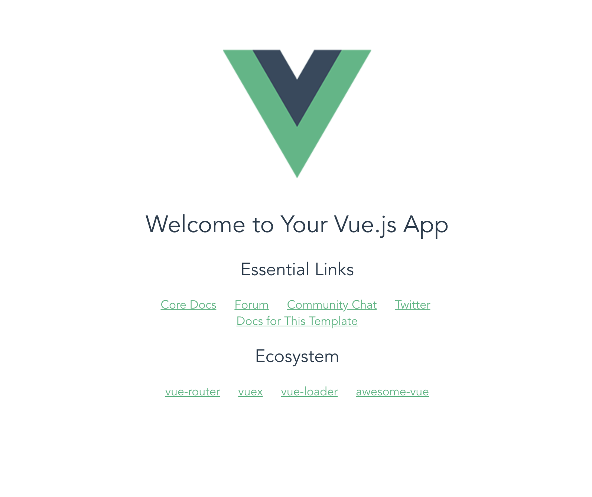
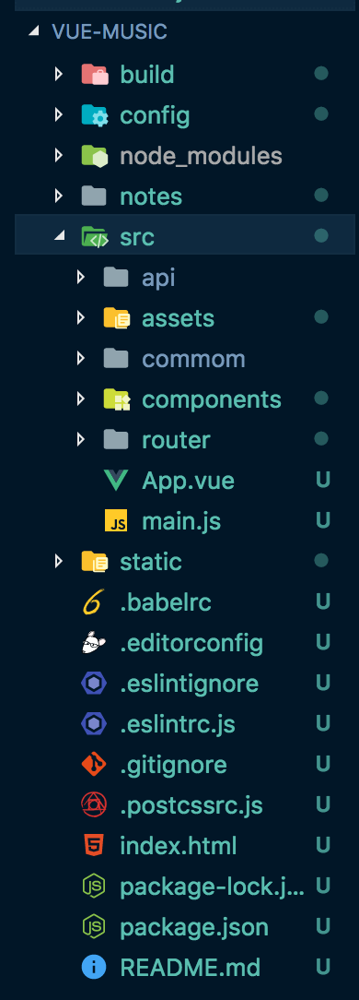
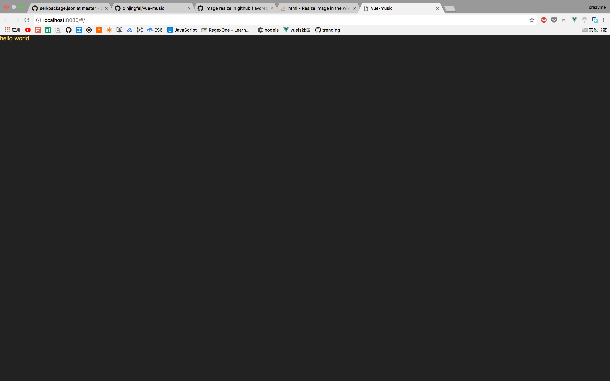

# 项目准备


## vue-cli 脚手架安装

`vue init webpack vue-music`



初始化完成后, 运行 `npm run dev`, 打开`http://localhost:8080`, 可以看到vue的初始页面




## 项目目录等资源

项目目录



* `api` 放一些与后端请求有关的代码(ajax, jsonp等)
* `commom` 放一些通用静态资源(字体文件，公用的图片等)
* `components` 放一些vue组件
* `router` 路由相关文件
* `store` vuex 相关


`commom` 文档 

```
.
├── fonts
│   ├── music-icon.eot
│   ├── music-icon.svg
│   ├── music-icon.ttf
│   └── music-icon.woff
├── image
│   └── default.png
├── js
└── stylus
    ├── base.styl
    ├── icon.styl
    ├── index.styl
    ├── mixin.styl
    ├── reset.styl
    └── variable.styl
```

* `fonts` 字体文件
* `stylus`
	* `base.styl` 基础样式
	* `icon.styl` 字体文件
	* `index.styl`  import 一些文件
	* `mixin.styl` 常用的styl 方法
	* `reset.styl` reset 元素默认值
	* `variable.styl` 定义规范

引入stylus文件后，需要安装 `stylus` 和 `stylus-loader`

```
npm install --save-dev stylus stylus-loader   
```

`src/main.js` 引入`index.styl`

```
import '@/common/stylus/index.styl'
```

`src/App.vue` 把`css`改成`stylus`

```
<template>
  <div id="app">
    hello world
  </div>
</template>

<script>
export default {
  name: 'App'
}
</script>

<style lang="stylus" scoped>
@import './common/stylus/variable'

#app
  color: $color-theme
</style>


```

`src/router/index.js` 去掉默认的路由

```
Vue.use(Router)

export default new Router({
  routes: [
  ]
})

```
`.eslintrc.js`中加入一些规则

```
rules: {
    //不检测文件末尾有没有空行
    'eol-last': 0,
    //fucntion左括号有没有空格
    'space-before-function-paren': 0
  }
```


现在运行`npm run dev`, 就可以看到

