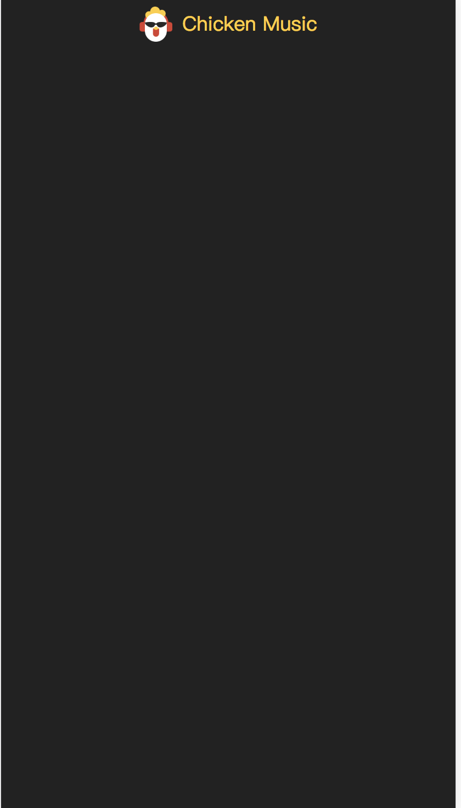
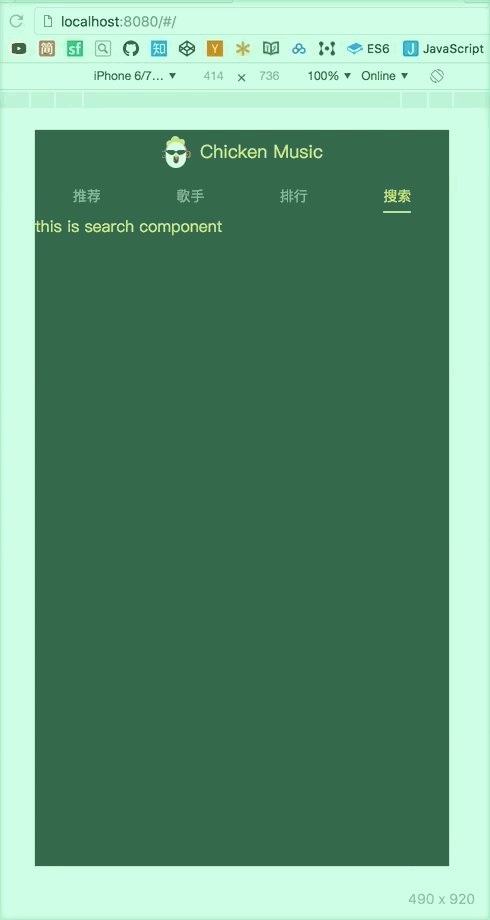

# 页面框架开发

## 页面入口 + header组件的编写


`index.html`加入移动端适配

```html
 <meta name="viewport" content="width=device-width,initial-scale=1.0, maximum-scale=1.0,
    minimum-scale=1.0, user-scalable=no">
```

安装`babel-runtime`, `fastclick`和 `babel-polyfill`

* `babel-runtime` 会对一些es语法转义
* `fastclick` 解决移动端300ms延迟
* `babel-polyfill` es6 promise等转义

```bash
npm install babel-runtime fastclick --save;
npm install babel-polyfill --save-dev;
```

把已经写好的`m-header`folder 放入 `src/components`里

```
├── components
│   └── m-header
│       ├── logo@2x.png
│       ├── logo@3x.png
│       └── m-header.vue
```

`src/App.vue`里注册并使用`m-header` 组件

```html
<template>
     <!-- ...   -->
    <m-header></m-header>
    <!-- ...  -->
</template>

```

```javascript
import MHeader from 'components/m-header/m-header'
export default {
   // ...
  components: {
    MHeader
  }
  // ...
}
```

同时，要在`build/webpack.base.conf.js`加入`components`的别名

```javascript
alias: { 
		  // ...
        'components': resolve('src/components')   //加入components别名
        //...
    }
```

配置完成后，运行一下`npm run dev`, 效果如下




## 路由配置


在`src/componets`下，创建以下组件

```
├── components
│   ├── m-header
│   │   ├── logo@2x.png
│   │   ├── logo@3x.png
│   │   └── m-header.vue
│   ├── rank
│   │   └── rank.vue
│   ├── recommend
│   │   └── recommend.vue
│   ├── search
│   │   └── search.vue
│   ├── singer
│   │   └── singer.vue
│   └── tab
│       └── tab.vue

```

`src/router/index.js` 配置路由

```

export default new Router({
  routes: [
    {
      path: '/',
      redirect: '/recommend'
    },
    {
      path: '/recommend',
      component: Recommend
    },
    {
      path: '/search',
      component: Search
    },
    {
      path: '/singer',
      component: Singer
    },
    {
      path: '/rank',
      component: Rank
    }
  ]
})
```

效果如下



