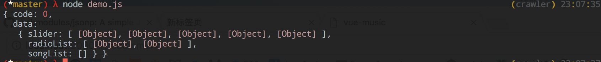
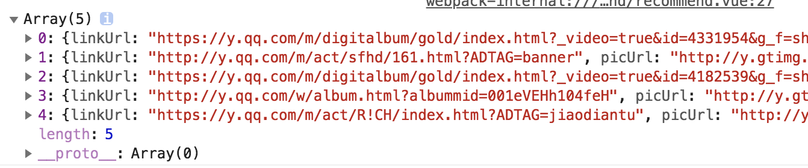

# 3.1 jsonp(轮播图数据抓取)

如何获取qq音乐上的轮播图数据?


## node(superagent)
如果，使用node的话，可以用`superagent`很轻松的获取数据

```
const url = 'https://c.y.qq.com/musichall/fcgi-bin/fcg_yqqhomepagerecommend.fcg'

const commonParams = {
    g_tk: 5381,
    format: 'json',
    inCharset: 'utf-8',
    outCharset: 'utf-8',
    platform: 'h5',
    needNewCode: 1,
    uin: 0
  }

async function getText(url, query) {
  const response = await request
    .get(url)
    .query(query)
    .catch(err => console.log(err))
  const text = response.text
  console.log(JSON.parse(text))
  return text
}

getText(url, commonParams)

```



## JSONP

由于浏览器的同源策略，所以, 我们不能像node一样用superagent。我们需要CORS(Cross Origin Resource Sharing)---跨域。 JSONP 是跨域的解决方案之一.

首先，安装JSONP的一个package(https://github.com/webmodules/jsonp).

```
npm install jsonp --save
```
在 `src/js`创建`jsonp.js` 以及`src/api`创建 `config.js`和`recommend.js`

在写`jsonp.js`文件之前`,需要先了解什么是query string。

### Query String

URL的一个例子

```
http://example.com/path/to/page?name=ferret&color=purple

// web forms
field1=value1&field2=value2&field3=value3...
```
* `?` : separateor
* The query string is composed of a series of field-value pairs.
* Within each pair, the field name and value are separated by an equals sign, "=".
* The series of pairs is separated by the ampersand, "&" 

[Wiki Query String](https://en.wikipedia.org/wiki/Query_string)


`src/common/jsonp.js`

```
export default function jsonp(url, data, option) {
  url += (url.indexOf('?') < 0 ? '?' : '&') + param(data) // 如果url中有?的话, ?. 没有的话 &

  return new Promise((resolve, reject) => {
    originJsonp(url, option, (err, data) => {
      if (!err) resolve(data)
      else reject(err)
    })
  })
}

// @param {Object} data
// @return {String} url
export function param(data) {
  let url = ''
  for (var k in data) {
    let value = data[k] !== undefined ? data[k] : '' // 如果data[k]为undefined, 让它等于''. 否则等于自己
    url += '&' + k + '=' + encodeURIComponent(value) // 例子“&g_tk=1928093487&inCharset=utf-8&outCharset=utf-8&notice=0&format=jsonp”
  }
  return url ? url.substring(1) : '' // 如果url不为空的话，去掉开头的&. 否则，让url等于''
}

```

* function param 把一个data 对象 转化为一个query string
* function jsonp 成功返回一个从url返回数据的promise对象，失败返回err的promise对象

`src/api/config.js`  放置一些需要请求的配置数据

```
export const commonParams = {
  g_tk: 1928093487,
  inCharset: 'utf-8',
  outCharset: 'utf-8',
  notice: 0,
  format: 'jsonp'
}

export const options = {
  param: 'jsonpCallback'
}

export const ERR_OK = 0

```

`src/api/recommend.js` 把`config.js`中的数据传给`jsonp` function

```

import jsonp from 'common/js/jsonp'
import {commonParams, options} from './config'

/**
 * @return {function} jsonp
 */
export function getRecommend() {
  const url = 'https://c.y.qq.com/musichall/fcgi-bin/fcg_yqqhomepagerecommend.fcg'

  const data = Object.assign({}, commonParams, { // merge multiple sources
    platform: 'h5',
    uin: 0,
    needNewCode: 1
  })
  console.log(data)
  return jsonp(url, data, options)
}

```


其他的代码不太重要略过. 如果想要阅读其他修改的代码，通过 `git diff` 来阅读修改的代码.

通过jsonp得到轮播的数据

