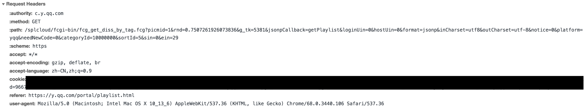

# 如何获得QQ歌单数据

之前我们通过`jsonp`的方式抓去了轮播图的数据，那可不可以用相同的方法抓取qq歌单的数据呢？


可以看到，我们并没有得到想要的数据。这是为什么呢?
因为，qq音乐做了host和referer的校验。

## Host && Origin && Referer

* 什么是host?

指定请求的服务器的域名和端口号

Host: www.zcmhi.com

* 什么是origin?

用来说明请求从哪里发起的，包括，且仅仅包括协议和域名。
这个参数一般只存在于CORS跨域请求中，可以看到response有对应的header：Access-Control-Allow-Origin。

* 什么是 referer?

referer是用来告诉服务器请求来自哪里，所以服务器可以判断请求来至哪里，如果不是本网站或者不是希望的网址，可以拒绝请求，防止盗链

Referer: http://www.zcmhi.com/archives/71.html



[HTTP Request Header 请求头](https://blog.csdn.net/lipeigang1109/article/details/59057525)

[HTTP Request fields](https://www.w3.org/Protocols/HTTP/HTRQ_Headers.html#z14)

## axios得到qq歌单数据

下面的博客已经进行了详细的介绍，我就不重复了 

[如何改变请求的host以及referer抓取做了host以及referer限制的接口数据](https://blog.csdn.net/Fabulous1111/article/details/78840353)

## superagent得到qq歌单数据


```
async function getCherrio(url) {
    const response = await request
        .get(url)
        .query(data)
        .buffer(true)  // ********必须要这个，不然得到undefined****************
        .set('referer', 'https://y.qq.com/m/index.html')
        .set('host', 'c.y.qq.com')
    const text = response.text
    console.log(response.text)
    return cheerio.load(text)
}

```
query里的`data`对象位于 `./src/api/config.js`

这里面最重要的是 `referer`和`host`的设置。

关于为什么要设置`buffer(true)`，请看这面的文章.

[浏览器能正常访问的url，superagent不能正常访问](https://cnodejs.org/topic/5b630ef0b71aedfe4c1266a3)

